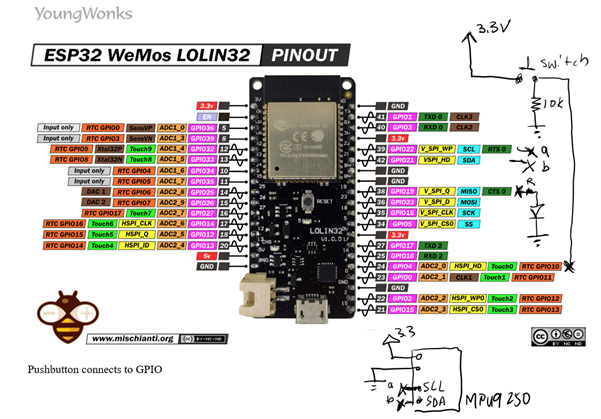
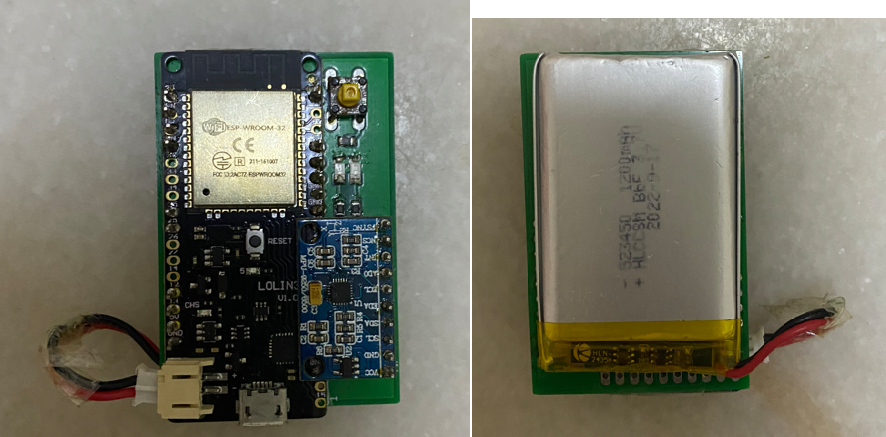
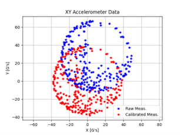
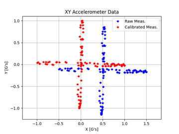
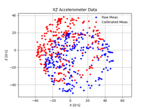
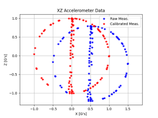
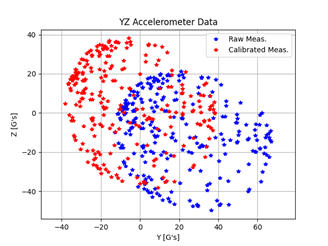
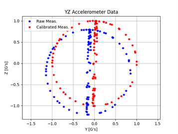

Resources:
1. ESP32 and IMU: https://github.com/tuupola/micropython-mpu9250 
2. Calibration: https://github.com/michaelwro/accelerometer-calibration
3. Madgwick: https://github.com/micropython-IMU/micropython-fusion
4. PC visualization: https://github.com/nagyf/mpu9250-visualization 
                   : https://github.com/nagyf/mpu9250-arduino 

# Sensor Fusion and Dashboard System using ESP32 and IMU

## Table of Contents
1. [Sensor Design](#sensor-design)  
        1.1 [Calibration](#calibration)  
2. [Bluetooth Setup](#sensor-algorithm)        
        2.1. [Installation Dependencies](#installation-dependencies)    
        2.2 [Running the Application](#running-the-application)

## Sensor Design
Description and details of the circuit diagram.



## Calibration
The magentometer, gyro and accelerometer require calibration.

|          | Magnetometer | Gyro | Accelerometer |
| -------- | -------- | -------- | -------- |
| Time required to calibrate the sensor   | About 20 seconds   | About 2 seconds   | Difficult. May takes more than 1 hour   |
| Frequency of calibration   | require to calibrate at new location   | Every measurement   | One time only  |
| Methods of calibration   | Move in circle in three axis | put flat on table  | Measure all three axis without moving it (and measure all three axis with respect to gravity)  |

Before and After calibration.
Magnetometer           |  Accelerometer
:-------------------------:|:-------------------------:
  |  
  |  
  |  

## Bluetooth Setup
## Installation Dependencies

Execute these commands to run the application:
```
> python -m venv myenv
> \myenv\Scripts\activate
> pip install -r requirements.txt
```

```
> myenv\Scripts\deactivate.bat
```
## Running the Application

The command is: `python main.py -d <device_id> -b <data_rate> -o <test_csv_file>`
                `python main.py -d COM10 -b 115200 -o text_20-5-2023.cvs`
        Noting that you need to go to Thonny and check what <device_id> is it.
               

Where: 

- `device_id` is the name of the serial port on which the arduino is connected. The easiest way to find it out is to launch the Arduino IDE and in the you search for it `Tools -> Port` menu, it will be something like `/dev/cu.usbmodem14411` on a Mac.
- `baud_rate` is the data rate used to communicate on the serial port
- `test_csv_file` is the filename of a file to write data to (this parameter is optional).

